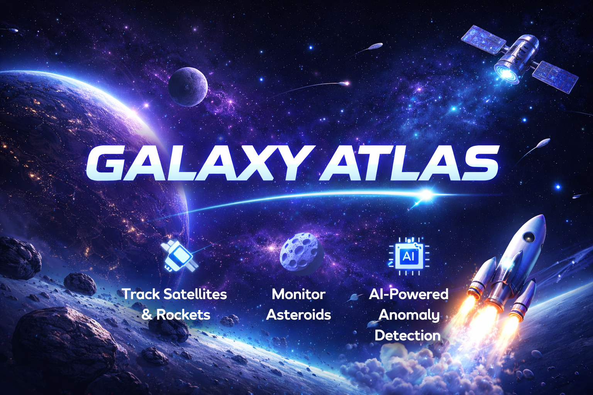

# GALAXY ATLAS
## Roket, Uydu ve Asteroid Takip Sistemi

---

## Proje Hakkında

### Proje Tanımı

Galaxy Atlas, uzay nesnelerinin (asteroidler, uydular ve roketler) takip edilmesini sağlayan web ve mobil tabanlı bir sistemdir.  
Kullanıcılar uzay nesnelerini listeleyebilir, detaylarını görüntüleyebilir, karşılaştırabilir ve filtreleyebilir.  

Sistem ayrıca yapay zeka destekli anomali tespiti özelliği ile normal değer aralığının dışındaki uzay nesnelerini tespit ederek kullanıcıya bildirir.  

Amaç, uzay verilerini kullanıcı dostu ve modern bir arayüz ile erişilebilir hale getirmektir.

---

## Proje Kategorisi

Uzay Teknolojileri / Veri Analizi / Takip Sistemi

---

## Referans Uygulama

NASA Open Data Portal  
ESA Space Tracking Systems  

---

## Proje Linkleri

- REST API Adresi: yakında eklenecek
- Web Frontend Adresi: yakında eklenecek
- Mobil Uygulama: yakında eklenecek

---

## Proje Ekibi

**Grup Adı:** Galactic Devs  

**Ekip Üyeleri:**

- Murat Dimlit
- Berra Doğruer

---

## Dokümantasyon

Proje dokümantasyonuna aşağıdaki linklerden erişebilirsiniz:

1. [Gereksinim Analizi](Gereksinim-Analizi.md)
2. [REST API Tasarımı](API-Tasarimi.md)
3. [REST API](Rest-API.md)
4. [Web Front-End](WebFrontEnd.md)
5. [Mobil Front-End](MobilFrontEnd.md)
6. [Mobil Backend](MobilBackEnd.md)
7. [Video Sunum](Sunum.md)